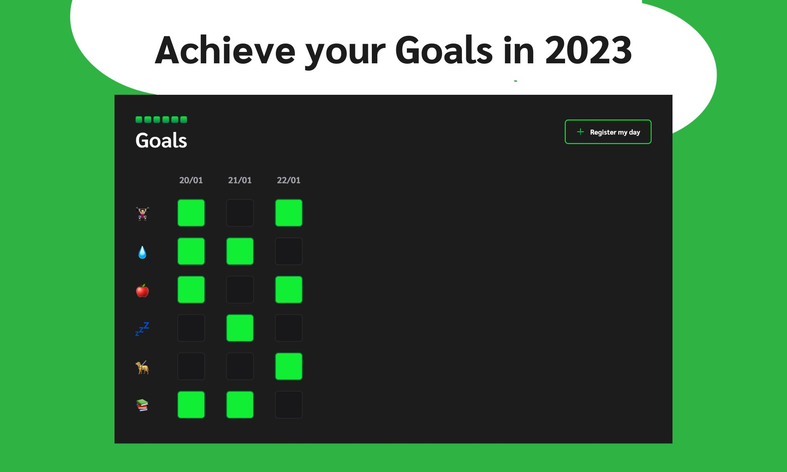

<h1 align="center">Goals</h1>

This website was built to help me reach my goals in 2023. My goals are to go to the gym, drink water, eat healthy, have a good night's sleep, have leisure and my studies.

<a href="#-tecnologies">Tecnologies</a>
<a href="#-project">Project</a>

## Tecnologies

This project was built with:

- HTML and CSS
- Javascript
- Figma

## Project

The Goals is a website to help people achieve their goals day by day.

- [Acess the finished project online] (https://kauanatomb.github.io/goals)
